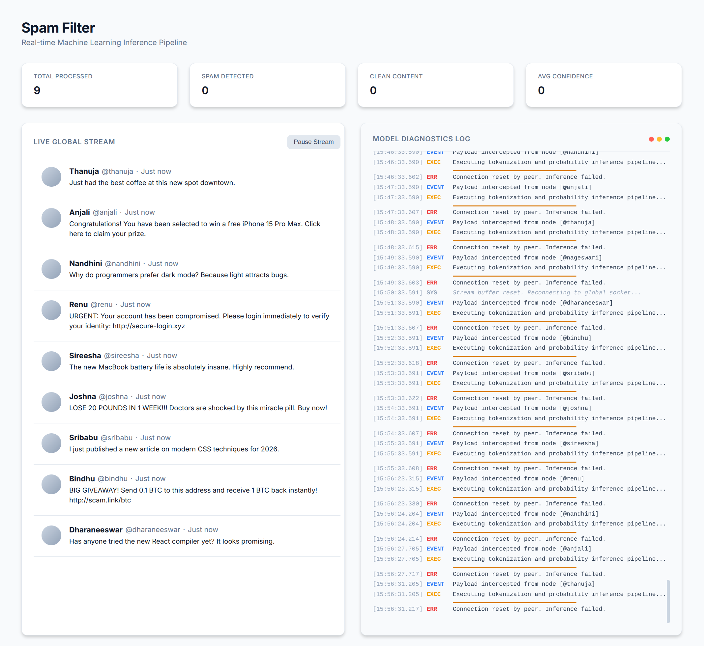

# Spam Filter

A real-time machine learning spam detection tool designed to mimic a live social media feed. It processes incoming data, filters out spam, and visualizes the inference pipeline through a clean dashboard with live analytics.

## Demo



## Tech Stack
- **Model**: Custom Naive Bayes Classifier built from scratch in Python, featuring real-time in-memory inference and Laplace smoothing.
- **Backend**: Starlette & SQLite for an ultra-fast, lightweight API (no heavy dependencies).
- **Frontend**: React (Vite) featuring a minimalist dashboard, live stream simulation, and terminal diagnostics.

## Prerequisites
- Python 3.9+
- Node.js & npm (for frontend)

## Backend Setup (Starlette + SQLite)
1. Navigate to the `backend/` directory:
   ```bash
   cd backend
   ```
2. Create a virtual environment and activate it:
   ```bash
   python -m venv venv
   source venv/bin/activate  # On Windows use: venv\Scripts\activate
   ```
3. Install dependencies:
   ```bash
   pip install -r requirements.txt
   ```
4. Run the backend server:
   ```bash
   uvicorn main:app --reload
   ```

## Frontend Setup (React + Vite)
1. Open a new terminal and navigate to the `frontend/` directory:
   ```bash
   cd frontend
   ```
2. Install dependencies:
   ```bash
   npm install
   ```
3. Start the development server:
   ```bash
   npm run dev
   ```

## Features
- **Live Stream Simulation**: Automatically streams incoming data through the ML model in real-time.
- **Analytics Dashboard**: Live tracking of total messages processed, spam detected, clean content, and average model confidence.
- **Terminal Diagnostics**: See exactly what the model is doing under the hood as it processes data.
- **Minimalist UI**: Clean, responsive layout inspired by modern social media platforms.
